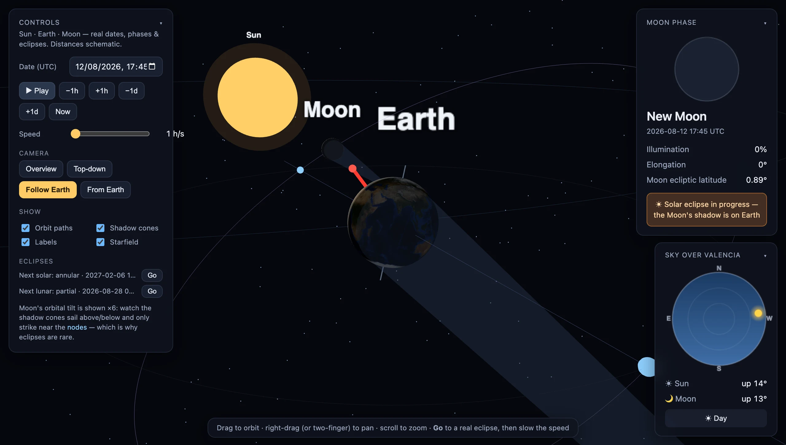

# Dimoon

An interactive **Sun · Earth · Moon** model for building intuition about **moon phases** and **eclipses** — driven by **real astronomy for real calendar dates**. Pick a date and the phases match your calendar; the eclipse list shows actual upcoming eclipses you can jump to. Single self-contained HTML file, no build step.

**→ [dimoon.pages.dev](https://dimoon.pages.dev)**



## Run it locally

Open `index.html` through a local web server (ES modules + import maps don't work from `file://`), and it needs internet to load Three.js and Astronomy Engine from a CDN:

```bash
python3 -m http.server 8000
# then open http://localhost:8000
```

## Deploy

Static files, no build — deploy the folder to any CDN. For Cloudflare Pages:

```bash
./deploy.sh   # assembles dist/ (index.html + favicon + _headers) and pushes → dimoon.pages.dev
```

Needs `npx wrangler login` once. `_headers` keeps the page on a short cache so a redeploy reaches everyone quickly.

## Real angles, schematic distances

The one thing that can't be real is **scale** — true Sun/Earth/Moon distances and sizes can't share a screen (the Moon would be an invisible speck thousands of widths away), so those stay compressed. **Everything angular is real**, computed per-instant from [Astronomy Engine](https://github.com/cosinekitty/astronomy):

- The Sun's and Moon's **geocentric ecliptic longitude & latitude** → real phase and real node crossings (the Moon's ~5.14° tilt, so eclipses are correctly rare).
- Real **moon phase** (name, illuminated %, elongation) and the Moon's real **ecliptic latitude** (how far it is from a node).
- Real **eclipses**: the app knows the actual next solar & lunar eclipse and only shows an eclipse when one is genuinely in progress.
- A real **observer** (Valencia by default): the sky card shows the true local altitude/azimuth of the Sun and Moon.

## What it shows

- **Sun** as the only light source — the Moon's phase emerges *physically* from geometry.
- **Earth** at its real orbital position, wearing a NASA Blue Marble texture and turned to its **real Earth-fixed orientation** — so the geography lines up with everything else. A **red stick** marks the observer's location (it sits on Spain's east coast for Valencia) and sweeps around as Earth really rotates, pointing at the Sun at local noon.
- **Moon** at its real geocentric ecliptic position, riding above/below the flat ecliptic reference ring by its real latitude — crossing it at the nodes.
- A live readout: date, phase name, illuminated %, elongation, Moon ecliptic latitude, and a real eclipse banner.
- A 2D **phase disc** showing the Moon as it looks from Earth at that instant.
- A **"Sky over Valencia" card** — a real all-sky dome. The Sun and Moon are plotted at their true topocentric **altitude/azimuth**; the dome tints blue by day and dark at night. As time runs you watch them **rise and set**, and during a solar eclipse the Sun and Moon sit right on top of each other.
- **Eclipse shadows.** During a real eclipse the model projects the Moon's shadow as a dark spot on Earth's daylit face (solar), or darkens the Moon inside Earth's shadow (lunar). The solar spot's **ground location is computed from real distances** (the schematic scale can't place it — where an eclipse lands depends on the true ~60× Moon-distance/Earth-radius ratio), so it sits under the real observer — e.g. right on Valencia at its 2026-08-12 sunset totality.

## Controls

- **Date/time picker (UTC)**, play/pause, ±1h / ±1d step, **Now**, and a speed slider (simulated days or hours per real second).
- **Eclipses** panel: the next solar and lunar eclipse with dates — hit **Go** to jump straight to the peak (then lower the speed to watch it unfold).
- **Camera:** Overview · Top-down · **Follow Earth** (centers on Earth and rides along as it orbits) · **From Earth**. Right-drag / two-finger to pan.
- **Toggles:** orbit paths, shadow cones, labels, starfield.

## The two key ideas it's built to teach

1. **Phases** = how much of the Sun-lit hemisphere faces us. Full when Earth is between Sun and Moon; new when the Moon is between us and the Sun.
2. **Eclipses** need *two* things at once: a new/full moon **and** the Moon near a node (crossing the ecliptic). Because the orbit is tilted ~5°, most new/full moons miss — which is why the eclipse list has real gaps.

## Stack

Three.js r160 + OrbitControls and [astronomy-engine](https://www.npmjs.com/package/astronomy-engine) 2.1.19, both via CDN import map; the Earth texture is NASA's Blue Marble served from `three-globe` on unpkg. Vanilla JS/Canvas for the UI, phase disc, and sky dome. No install, no bundler. Change the observer by editing the `OBS` constant near the top of the script.

## Licence

Code is [MIT](LICENSE). The libraries and the Earth texture it loads at runtime are not mine to relicense — Three.js (MIT), astronomy-engine (MIT), and NASA's Blue Marble imagery (public domain, served via `three-globe`).
